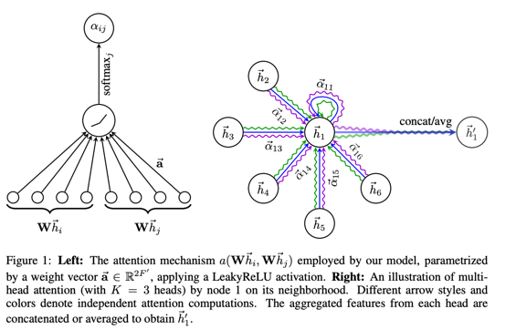

```
       .---.
      /_____\
      ( '.' )     STOP BEING A FRAUD!
       \_-_/_
    .-"`'V'//-.
   / ,   |// , \
  / /|Ll //Ll|\ \
 / / |__//   | \_\
 \ \/---|[]==| / /
  \/\__/ |   \/\/
   |/_   | Ll_\|
     |`^"""^`|
     |   |   |
     |   |   |
     |   |   |
     |   |   |
     L___l___J
      |_ | _|
     (___|__)
```
# TL;DR
This repo contains thoughts and code on how to enhance GNNs Performance on Money Laundry Detection using Geometric Based Feature-Extraction. 

# 0. System Structure - Whats included
1. Docker Container containing a graph database (Neo4j) for the KG/PG Storage and Logical Inference/Preprocessing
2. An model training service (`src/training.py`)
3. An inference service consisting of: 
   i.  Backend-Service (`src/main.py`)
   ii. A web-based UI (`src/dash_brond_end.py`)


# 1. Introduction
In this project I have investigated **Graph Structure-based Fraud Detection** in Financial Transaction Networks with the help of **Geometry** and **Graph Neural Networks**.
Initially inspired by the big issue of *Value-Added-Tax Fraud*, where in 2021 alone approx. 15 billion euros have been stolen by criminals applying Value-Added-Tax Fraud-techniques in the EU according to [*Ott (2024)*](https://epub.jku.at/obvulihs/download/pdf/10500928).
Due to lack of publicly available data, I had to switch to something similar: Money Laundry Patterns in Transaction Networks. As I chose a geometry based approach in combination with GNNs, it might still be useful for VAT Fraud as well.


Therefore, I try to **bring my own method** to detect money laundering in the geometrical structures present in the IBM Transactions for Anti Money Laundering (AML) while orienting myself on the following three papers:
- [The geometry of suspicious money laundering activities in financial networks](https://perfilesycapacidades.javeriana.edu.co/en/publications/the-geometry-of-suspicious-money-laundering-activities-in-financi)
- [Provably Powerful Graph Neural Networks for Directed Multigraph](https://arxiv.org/pdf/2306.11586)
- [Smurf-based Anti-money Laundering in Time Evolving Transction Networks](https://www.researchgate.net/publication/354487674_Smurf-Based_Anti-money_Laundering_in_Time-Evolving_Transaction_Networks)

For this purpose, I am using the following dataset:
-  [IBM - Syntetic Transaction Data for Anti-Money-Laundry Dataset](https://www.kaggle.com/datasets/ealtman2019/ibm-transactions-for-anti-money-laundering-aml/data): 


This data looks the following and contains 180 Mio. of those transactions (rows), with a high and low Laundering-Transaction Share.

# 2. Dataset

| Timestamp       | From Bank | Account    | To Bank | Account    | Amount Received | Receiving Currency | Amount Paid | Payment Currency | Payment Format | Is Laundering |
|-----------------|-----------|------------|---------|------------|-----------------|--------------------|-------------|------------------|----------------|---------------|
| 01.09.22 0:08   | 11        | 8000ECA90  | 11      | 8000ECA90  | 3195403         | US Dollar          | 3195403     | US Dollar        | Reinvestment   | 0             |
| 01.09.22 0:21   | 3402      | 80021DAD0  | 3402    | 80021DAD0  | 1858.96         | US Dollar          | 1858.96     | US Dollar        | Reinvestment   | 0             |
| 01.09.22 0:00   | 11        | 8000ECA90  | 1120    | 8006AA910  | 592571          | US Dollar          | 592571      | US Dollar        | Cheque         | 0             |
| 01.09.22 0:16   | 3814      | 8006AD080  | 3814    | 8006AD080  | 12.32           | US Dollar          | 12.32       | US Dollar        | Reinvestment   | 0             |
| 01.09.22 0:00   | 20        | 8006AD530  | 20      | 8006AD530  | 2941.56         | US Dollar          | 2941.56     | US Dollar        | Reinvestment   | 0             |
| 01.09.22 0:24   | 12        | 8006ADD30  | 12      | 8006ADD30  | 6473.62         | US Dollar          | 6473.62     | US Dollar        | Reinvestment   | 0             |
| 01.09.22 0:17   | 11        | 800059120  | 1217    | 8006AD4E0  | 60562           | US Dollar          | 60562       | US Dollar        | ACH            | 0             |

and includes the following columns:

| Column             | Description                                                                 |
|--------------------|-----------------------------------------------------------------------------|
| Timestamp          | The date and time when the transaction occurred.                            |
| From Bank          | The identifier of the bank from which the funds were sent.                  |
| Account            | The account number from which the funds were sent.                          |
| To Bank            | The identifier of the bank to which the funds were sent.                    |
| Account            | The account number to which the funds were sent.                            |
| Amount Received    | The total amount of money received in the transaction.                      |
| Receiving Currency | The currency in which the amount was received.                              |
| Amount Paid        | The total amount of money paid in the transaction.                          |
| Payment Currency   | The currency in which the payment was made.                                 |
| Payment Format     | The method or format used for the payment (e.g., Reinvestment, Cheque, ACH).|
| Is Laundering      | Indicates whether the transaction is suspected of money laundering (0 = No).|

A more in-depth dataset analysis can be found [here](https://www.kaggle.com/datasets/ealtman2019/ibm-transactions-for-anti-money-laundering-aml/data:)

# 3. Implementation
The core in this project is a neuro-symbolic DL approach, combining symbolic AI (logics / Rule-based approaches) and graph neural networks.
My own Method consists of combining geometry-based preprocessing with powerful Graph Neural Networks for directed Multi graphs.

## 1. Setup / Data Preparation
I used a dockerized Neo4j database to store the previously mentioned dataset as property graph, for further analysis.
The thereby created Ontology/Property Map can be found in `src/data_insertion_to_neo4j.py` or in this `Cypher Query`:

```cypher
MERGE (fromBank:Bank {id: $From_Bank})
MERGE (toBank:Bank {id: $To_Bank})
MERGE (fromAccount:Account {id: $From_Account})
MERGE (toAccount:Account {id: $To_Account})
        
MERGE (fromBank)-[:BANK_OWNS_ACCOUNT]->(fromAccount)
MERGE (toBank)-[:BANK_OWNS_ACCOUNT]->(toAccount)
                
CREATE (fromAccount)-[:TRANSFERRED_TO {
        amount_paid: $Amount_Paid, 
        currency_paid: $Payment_Currency, 
        time_of_transaction: $timestamp
}]->(toAccount)                
```


For information about the thereby created graph, on might find something useful in `src/stats/Neo4jStatisticsReport.py`.


## 2. Geometry-based Preprocessing
For this part, I utilized geometric models to preselect the networks on which the Graph (Neural) Nets are trained and tested.

I expect this to increase the efficiency and performance in correctly classifying Money Laundry Transactions (measured by the *F1 Score* , as I hoped to increase the quality of the GNNs Training data by filtering out obviously irrelevant sub-graphs).
In addition, I expect this to yield an overall lower computational complexity of the GNN Training.
In order to do so, I've borrowed some thoughts from [Granados et al. (2022)](https://perfilesycapacidades.javeriana.edu.co/en/publications/the-geometry-of-suspicious-money-laundering-activities-in-financi) 

In this paper, the authors documented the following geometric elements: 

- A **path** is a finite sequence of distinct edges joining a sequence of distinct vertices.

- A **circuit** is a non-empty path in which the first and last vertices are repeated.

- A **cycle** or simple circuit is a circuit in which the only repeated vertices are the first and the last vertices. If there are no external edges connecting any two of its vertices it is called a chordless cycle or hole.

- A **clique** is a set of vertices for which the corresponding subgraph is a complete graph. A maximal clique is a clique that is not properly contained in a larger one. A clique with k vertices will be called a k-clique (although there are other notions with the same name in the literature)


In order to identify (sub)graphs worth preselecting, I stuck to the general definition of *Money Laundering* by the **Financial Action Task Force (FATF)** that defines it as *the process by
which money generated through criminal activity appears to have come from a legitimate source.*
So based on the definition above, some characteristic behaviors of money laundry can, and have been derived by the **FATF** and **UNODC**:


- **Rule 1.** The money launderer agent's interactions do not grow rapidly because it is preferable to maintain only few interactions with other agents and to keep them as anonymous or covert as possible.

- **Rule 2.** The money launderer agent does not impose restrictions on the geographical distance required for those interactions. This includes the transference of money between a non-haven jurisdiction and a tax haven jurisdiction.

- **Rule 3.** The money launderer agent does not care how many transactions are needed to clean the illegal money (cycle), resorting to deposits triangulation between the same agents.

- **Rule 4.** The money launderer agent employs the breaking up of large amounts of money into smaller amounts to avoid suspicions. The money is then deposited into one or more bank accounts or other financial instruments either by different persons or by a single person over a period of time.

- **Rule 5.** After a process of money laundering interactions is initiated, it is to be expected that at some point (at least part of) the involved money returns to the money launderer agent completing a cycle.


Which then translates to the following geometric patterns: 

- **Rule 1.** Look for paths for which a proportionally important/central part of their nodes are not as highly connected as the rest.

- **Rule 2.** Do not restrict the location of those paths to be confined to a particular community (or other subset) of the graph.

- **Rule 3.** The length of the paths considered should not be restricted.

- **Rule 4.** Look for paths with several **bifurcation points** (Bifurcation points represent critical values in a system where sudden qualitative changes occur in its behavior. These changes manifest when small adjustments to parameter values cause significant shifts in the system's dynamics), and study their behavior from those points.

- **Rule 5.** Among the possible paths in the graph, closed paths or cycles are more relevant that simple paths.

I then used those rules for feature engineering and (sub) graph selection: 

### Rule 1: Look for paths with proportionally important part of nodes not as highly connected
```cypher

MATCH path = (start:Account)-[rel:TRANSFERRED_TO]->(end:Account)
WHERE start <> end AND size(nodes(path)) < averagePathLength
RETURN start,
       end,
       [rel IN relationships(path) | properties(rel)] AS all_relationship_attributes
```

### Rule 2: Do not restrict paths to a particular community
This rule is implicitly followed by not including any community-based filters in our queries.


### Rule 3: Do not restrict path length
We'll use variable-length relationships in our queries to allow for paths of any length. However, for performance reasons, we might need to set an upper limit in practice

### Rule 4: Look for paths with several bifurcation points

```cypher
MATCH path = (start:Account)-[r:TRANSFERRED_TO]->(end:Account)
WITH start AS n, end AS m, COUNT(r) AS branch_count, COUNT(start) AS incoming_count, path
WHERE branch_count > 1 OR incoming_count > 1
RETURN n AS start,
       m AS end,
       [rel IN relationships(path) | properties(rel)] AS all_relationship_attributes
```


### Rule 5: Among the possible paths in the graph, closed paths or cycles are more relevant that simple paths.

```cypher
MATCH path = (start:Account)-[:TRANSFERRED_TO*]->(end)
WHERE length(path) > 2 // Exclude trivial cycles
RETURN start,
       end,
       [rel IN relationships(path) | properties(rel)] AS all_relationship_attributes
```
All of the above combined eventually yielded a reduced graph that can be used for the GNN Training and Testing.

## 3. Graph Neural Networks
For comprehensive Analysis, multiple GNNs have been implemented and tested. More specifically, the following: 
- GATe (Graph Attention Network with edge features) / GAT
- GINe (Graph Isomorphism Network with edge features)
- PNA (Principal Neighbourhood Aggregation)
- RGCN (Relational Graph Convolutional Network)

The selection has been explicitly designed to incorporate the evolution of GNN Paradigms over Time. 


### GATe (Graph Attention Network with edge features)

GATe is an extension of the original Graph Attention Network (GAT) that incorporates edge features into the attention mechanism. Key characteristics include:

- Attention mechanism that considers both node and edge features together
- Delivers improved performance on graphs with rich edge information
- Possesses the ability to capture complex relationships between nodes and edges



GATe has shown promising results in tasks where edge attributes are crucial, such as molecular property prediction and social network analysis.

### GINe (Graph Isomorphism Network with edge features)

GINe is a variant of the Graph Isomorphism Network (GIN) that also takes edge features into account. Notable aspects include:

- Shines at preserving the expressive power of GIN for node and graph-level tasks
- Incorporates edge features in the message passing step
- Suitable for graphs where edge attributes carry important information

This model has been particularly effective in chemical and biological applications where bond types and other edge properties are significant.


### PNA (Principal Neighbourhood Aggregation)

PNA is a GNN architecture designed to be more adaptable to **diverse graph structures**. Key features include:

- Uses multiple aggregators (mean, max, min, standard deviation)
- Employs degree-scalers to adjust for varying node degrees
- Combines different aggregators and scalers for robust feature extraction

PNA has demonstrated state-of-the-art performance on various benchmarks, especially in tasks involving **graphs with heterogeneous structures**.

### RGCN (Relational Graph Convolutional Network)

RGCN is an extension of Graph Convolutional Networks (GCN) designed to handle multi-relational graphs. Important characteristics include:

- Supports multiple types of relationships between nodes
- Uses relation-specific weight matrices for different edge types
- Effective for knowledge graphs and other multi-relational data

RGCN has been successfully applied in various domains, including **knowledge base completion, entity classification, and link prediction in heterogeneous networks**.


## 4. Putting everything together & Evaluating: 
The combined approach of geometry-based preprocessing (GBPre) and GNNs can be found in `src/main.py`
In order to evaluate weather the GBPre is actually beneficial, I chose to use the *F1* Score as  defined as: 

$$\text{Precision} = \frac{TP}{TP + FP}$$


$$\text{Recall} = \frac{TP}{TP + FN}$$


$$F1 = \frac{2 \cdot \text{Precision} \cdot \text{Recall}}{\text{Precision} + \text{Recall}}$$


### Goal: 
While the absolut *F1 Score* is interesting, I want to investigate the relative difference between the models with and without GBPre. I target to achieve higher *F1* Scores with the GBPre models.
Nonetheless, an *F1 Score* below 0.5 would be bad, as it would indicate a worse performance than flipping a coin for choosing weather a transaction is money laundering or not.  


### Evaluation
In order to be able to compare the different models with and without the GBPre I ran every model with and without GBPre via a `benchmark_testing.sh`.
All important metrics have been stored and logged via **wand.ai**. 
All models have additionally been stored locally under `src/models`. This was possible as the size of each model was very low.


## Hyperparameter Tuning
For the Hyperparameter Tuning, I tried the following different sets of Hyperparameter Configurations: 

| Batch Size | Number of Epochs | Number of Neighbors         |
|------------|------------------|-----------------------------|
| 4096       | 50               | [50, 50]                    |
| 4096       | 50               | [100, 100]                  |
| 4096       | 50               | [150, 150]                  |
| 4096       | 100              | [50, 50]                    |
| 4096       | 100              | [100, 100]                  |
| 4096       | 100              | [150, 150]                  |
| 4096       | 150              | [50, 50]                    |
| 4096       | 150              | [100, 100]                  |
| **4096**   | **200**          | **[150, 150]** *(best one)* |
| 8192       | 50               | [50, 50]                    |
| 8192       | 50               | [100, 100]                  |
| 8192       | 50               | [150, 150]                  |
| 8192       | 100              | [100, 100]                  |
| ...        | ...              | ...                         |

## Results

With the best performing Hyperparameter, the models yielded the following performance: 

| Name           |Sweep|batch_size|dropout    |epochs|final_dropout|loss|lr         |model|n_gnn_layers|n_heads|n_hidden   |num_neighbors|w_ce1      |w_ce2      |best_test_f1|f1/test    |f1/train   |f1/validation|
|----------------|-----|----------|-----------|------|-------------|----|-----------|-----|------------|-------|-----------|-------------|-----------|-----------|------------|-----------|-----------|-------------|
| GBPre_PNA      |     |4096      |0.083404401|200   |0.288129797  |ce  |0.000611642|pna  |2           |       |20         |[100,100]    |1.000396767|7.077633468|0.418274112 |0.334883721|0.936030618|0.100558659  |
| **GBPre_RCGN** |     |4096      |0.009834683|200   |0.105276906  |ce  |0.006213266|rgcn |2           |       |66.00315516|[100,100]    |1.000018288|9.23       |0.493943472 |0.50831793 |0.950727884|0.24009324   |
| GBPre_GAT      |     |4096      |0.009      |200   |0.1          |ce  |0.006      |gat  |2           |4      |64         |[100,100]    |1          |6          |0.475916607 |0.467862481|0.786960514|0.258515284  |
| GBPre_GIN      |     |4096      |0.009834683|200   |0.105276906  |ce  |0.006213266|gin  |2           |       |66.00315516|[100,100]    |1.000018288|6.275014431|0.242557883 |0.397350993|0.853795211|0.131445905  |
| no_GBPre_PNA   |     |4096      |0.083404401|200   |0.288129797  |ce  |0.000611642|pna  |2           |       |20         |[100,100]    |1.000396767|7.077633468|0.454124904 |0.454192547|0.469369485|0.444698703  |
| no_GBPre_RCGN  |     |4096      |0.009834683|200   |0.105276906  |ce  |0.006213266|rgcn |2           |       |66.00315516|[100,100]    |1.000018288|9.23       |0.451086957 |0.430457746|0.486665782|0.432363014  |
| no_GBPre_GAT   |     |4096      |0.009      |200   |0.1          |ce  |0.006      |gat  |2           |4      |64         |[100,100]    |1          |6          |0.454371898 |0.455135548|0.467575487|0.450810403  |
| no_GBPre_GIN   |     |4096      |0.009834683|200   |0.105276906  |ce  |0.006213266|gin  |2           |       |66.00315516|[100,100]    |1.000018288|6.275014431|0.455309396 |0.419461502|0.498770156|0.427923844  |


#### F1 @ Testing


#### F1 @ Validation


#### F1 @ Testing


#### Best F1's: 


## Conclusion: 

Out of all models, **GBPre_RCGN** (RCGN with Geometry based Preprocessing) performed the best.
Also, in all cases except for *GBPre_GIN* the models with GBPre outperformed the standard models in the *F1_Test*
Nonetheless, I would advice to retest this with larger datasets. 


---

# How to run Inference
While the full inference service is planned to be finished for Assignment 3, a basic functionality is still provided via: 
`python main.py --inference modelname`

# How to train models
1. Set up the DB Infrastructure via `docker-compose up -d`. 
   You should now see the database UI at `http://localhost:7687/`
2. Install all needed packages (in your .venv) via `pip install -r requirements.txt`.
3. Download the data from [IBM - Syntetic Transaction Data for Anti-Money-Laundry Dataset](https://www.kaggle.com/datasets/ealtman2019/ibm-transactions-for-anti-money-laundering-aml/data) and store it in the `/data` directory.
4. Specify the data path in `src/data_insertion_to_neo4j.py` and run it via `python data_insertion_to_neo4j.py`.
   In order to be able to test the model training on small scale computational sorceress (e.g. the local computer) flags for this have been introduced: 
   `python your_script.py --rows_to_insert 10000 --local_test`. This modifies the original dataset so a limited number of rows can be used for local test-training. 
6. Run `src/main.py` with your desired configs to train models where the following arguments are available: 


### Required Arguments
`--model MODEL_NAME`: Specify the GNN architecture (Options: `gin`, `gat`, `rgcn`, `pna`)

### Optional Arguments

#### Model Adaptations
`--GBPre`: Enable Geometry based Preprocessing (default: False)

`--emlps`: Enable EMLP layers in GNN training

`--reverse_mp`: Enable reverse message passing in GNN training

`--ports`: Include port numbering features

`--tds`: Include time delta features (time between transactions)

`--ego`: Include ego ID features

#### Training Parameters
`--batch_size`: Training batch size (default: 8192)

`--n_epochs`: Number of training epochs (default: 100)

`--num_neighs`: Number of neighbors to sample per hop, in descending order (default: [100,100])

#### Data and Model Settings
`--seed`: Random seed for reproducibility (default: 1)

`--tqdm`: Enable progress bar for interactive terminal use

`--testing`: Run in testing mode without wandb logging

`--save_model`: Save the best performing model

`--unique_name`: Specify unique identifier for model storage

`--finetune`: Enable model fine-tuning (requires --unique_name pointing to pre-trained model)

`--inference`: Run inference only (requires --unique_name pointing to trained model)


### Example Usage:
```bash
# Train a GAT model with default parameters
python main.py --model gat

# Train a GIN model with custom settings
python main.py --model gin --batch_size 4096 --n_epochs 200 --emlps --ports

# Fine-tune a pre-trained PNA model
python main.py --model pna --finetune --unique_name pretrained_model_name```
```


# How to test: 
To execute the predefined (unit)test, run the following command in the project directory: 
```PYTHONPATH=./src pytest tests/```


---

# Appendix (A):  Efforts so far
## A.1 Dataset Collection and Preprocessing
- **Research and Identify Suitable Datasets**: 9 hours
- **Data Cleaning and Preprocessing**: 15 hours
- **Feature Engineering**: 50 hours

## A.2 Designing and Building the Graph Neural Network
- **Literature Review on Graph Neural Networks**: 10 hours
- **Network Architecture Design**: 15 hours
- **Implementation of the Network**: 35 hours

## A.3 Training and Fine-Tuning the Network
- **Initial Model Training**: 10 hours
- **Hyperparameter Tuning**: 10 hours
- **Validation and Testing**: 15 hours

## A.4 Building an Application to Present Results
- **Design User Interface**: 15 hours
- **Develop Application Backend**: 5 hours
- **Integrate Model with Application**: 0 hours

## A.5 Writing the Final Report
- **Drafting the Report Structure**: 0 hours
- **Writing and Editing Content**: 0 hours
- **Creating Visualizations and Appendices**: 0 hours

## A.6 Preparing the Presentation
- **Design Presentation Slides**: 0 hours
- **Rehearse Presentation Delivery**: 0 hours
